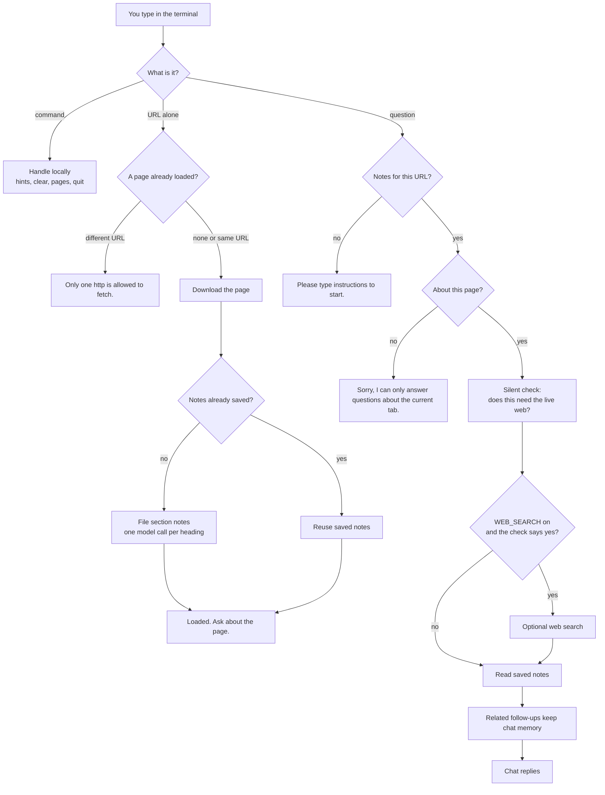

# Tabkit

Page-aware AI assistant that summarizes and extracts exact context about a web page in a terminal.

You paste an `http(s)` URL. Tabkit downloads the page, saves section notes on your machine, then you ask questions. The same notes are reused until you clear them.

**Works:** Wikipedia, HTML articles, most public pages.  
**Does not:** PDFs, Canvas, login walls, Python 3.9 and older.

You need your own OpenAI API key. The first load of a long page is the only expensive part because it takes the designated HTML heading text from the web page. It gets cheaper after the assistant compiles the web page context.

Do not commit or post `.env`. Do not post `debug.json` or anything under `backend/data/` — those can hold the page and your questions. Git already ignores them.

## Setup

```bash
cd tabkit
python -m venv .venv
```

Windows:

```bash
.venv\Scripts\activate
copy .env.example .env
pip install -r requirements.txt
```

macOS / Linux:

```bash
source .venv/bin/activate
cp .env.example .env
pip install -r requirements.txt
```

Open `.env` and set:

```
OPENAI_API_KEY=sk-...
```

This is optional, but there is a web search area; it uses a SerpAPI key. Page questions work without it. If you do not have one, set `WEB_SEARCH = False` in `backend/config.py`.

## Run

```bash
python run.py
```

On Windows, if `python` is not found, use `py run.py`.

Type `instructions` if you want the short how-to. Then paste a URL **alone on the line** (`http://` or `https://`, or `www.…`). No extra words. You need internet for that first fetch. Some sites that block bots return empty text.

A pasted URL only **loads** the page (`Loaded: …` then `Ask about the page.`). It is not a question. Chat starts on the next line you type.

**Only one http URL can be fetched at a time.** A second, different link gets `Only one http is allowed to fetch.` Use `clear all` to drop the current page, then paste a new one. Pasting the same URL again just says it is loaded.

If nothing is loaded, it says `Please type instructions to start.`  
Quit and come back: the last URL is still loaded. You do not paste it again.

The **first** time you load a URL is slow (it files notes). After that it is much cheaper until `clear pages`.

Commands ignore case and extra spaces. example: `Clear Memory` still works.

## Commands


| Command         | What it does                                               |
| --------------- | ---------------------------------------------------------- |
| `instructions`  | How to start                                               |
| `/hints`        | List commands                                              |
| `current url`   | Show the loaded page                                       |
| `pages`         | List saved section names                                   |
| `clear memory`  | Wipe chat memory                                           |
| `clear debug`   | Wipe debug.json (only if `DEBUG = True`)                   |
| `clear pages`   | Delete notes for this URL (next ask rescans)               |
| `clear all`     | Wipe memory, debug (if on), all page folders, and the saved current URL |
| `quit` / `exit` | Leave                                                      |


## Folders

```
tabkit/
  run.py                 start the terminal
  README.md              this file
  requirements.txt       Python packages
  .env.example           copy to .env and add your key
  backend/
    config.py            flags, keys, limits
    main.py              input loop and commands
    pipeline.py          one turn: file page, maybe search, reply
    commands.py          /hints, clear, pages, current url
    context.py           one turn of input
    pages/               download the URL, file notes, read them later
    chat/                the model that talks to you + session memory
    sufficiency/         silent step: does this question need the web?
    tools/               web search (only if WEB_SEARCH is on)
    debug/               writes debug.json when DEBUG is on
    data/                runtime notes, memory, debug (gitignored)
```

You normally only edit `backend/config.py` and, for cheaper scans, `backend/pages/fetch.py`. Leave the rest unless you are changing the program.

## How it works

What one turn looks like for the model.




Bare URL: download and file notes if needed. No chat reply and no web-search check — there is no question yet. A second different URL is refused until `clear all`.

Question: reuse notes, maybe search, then reply. Long threads keep recent turns and a short recap of the older ones.

Off-topic (math, homework, greetings, facts not on the page) is only this line: `Sorry, I can only answer questions about the current tab.` Asking to search / look it up is on-topic. example: a math question while an article is loaded.

If `DEBUG = True`, the same turn can also write `debug.json`. That is for you, not for the reply.

`DEBUG` writes `debug.json`. `WEB_SEARCH` allows the optional web-search step when the gate asks for it.

## Lower cost (fewer tokens)

Filing notes costs **one model call per heading**. Long pages with lots of `h2` / `h3` / `h4` sections get expensive.

If you are low on tokens, open `backend/pages/fetch.py` and only keep `h2` (drop `h3` and `h4`). Coarser sections, fewer files, cheaper first load.

Then run `clear pages` so it rescans with the new setting.

You can also lower `MAX_PAGE_SECTIONS` in `backend/config.py` as a hard cap.

## Config flags (`backend/config.py`)

Near the top:

```
DEBUG = True
WEB_SEARCH = True
```

- `True` — that feature is on.
- `False` — that feature is off.

